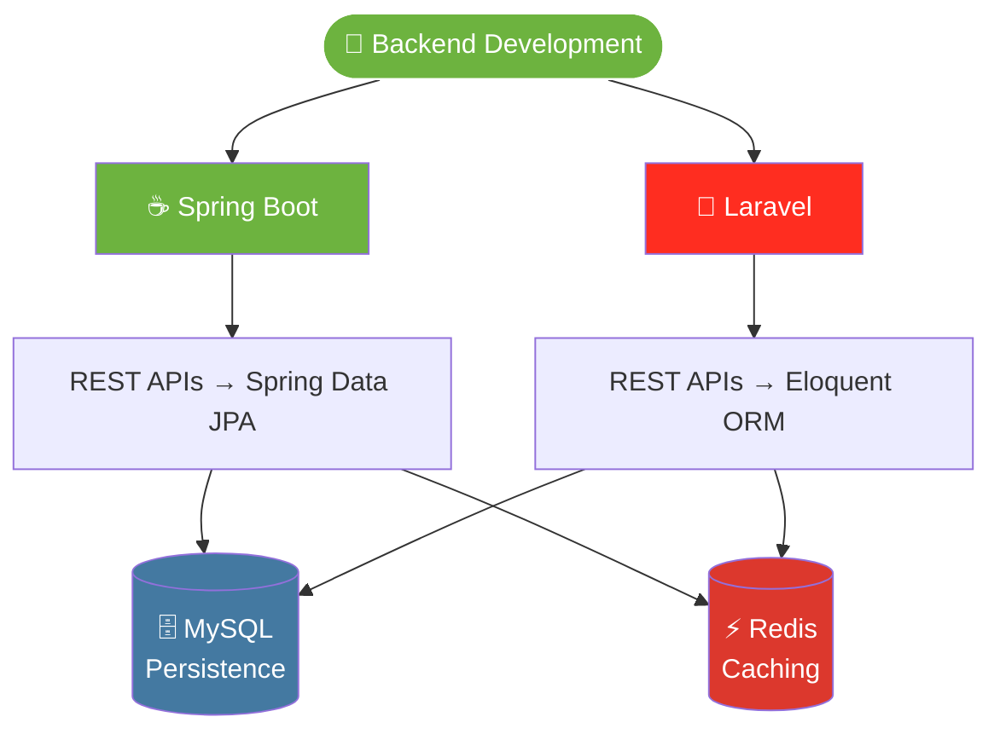
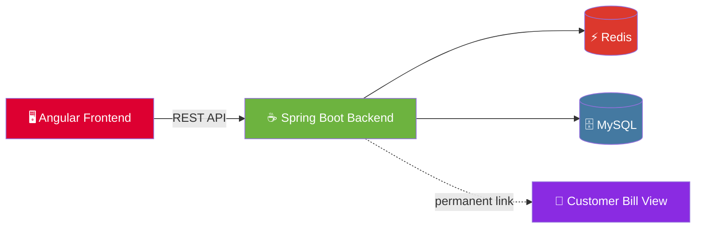

<div align="center">


<a href="https://github.com/sanishil">

</a>

<br/><br/>


<br/>

<h3>☕ Spring Boot Developer &nbsp;•&nbsp; 🐘 also Laravel</h3>


</div>


## 👋 &nbsp;Hey, I'm Sani!

```java
public class SaniShil {

    String role      = "Associate Software Development Engineer";
    String primary   = "Spring Boot";      // main backend framework
    String secondary = "Laravel";          // also comfortable with
    String focus     = "Backend Development & REST APIs";
    String[] stack   = {"Spring Boot", "Redis", "MySQL", "Laravel"};
    String[] tools   = {"Linux", "Git", "GitHub", "Postman"};
    String learning  = "Backend Engineering & System Design";
    String motto     = "Code • Build • Learn • Repeat";

    public void work() {
        while (true) {
            buildRestApis();
            cacheWithRedis();
            learnSystemDesign();
        }
    }
}
```

<div align="center">

| 💼 Role | ☕ Java Side | 🐘 PHP Side | ⚡ Performance |
|:---:|:---:|:---:|:---:|
| Associate SDE | **Spring Boot** + JPA | **Laravel** + Eloquent | **Redis** caching |

</div>


## 🛠️ &nbsp;Tech Arsenal

<div align="center">

### 🧠 Languages


### ⚙️ Backend Frameworks


### 🗄️ Database & Cache


### 🎨 Frontend


### 🧰 Tools


</div>


## 🚀 &nbsp;Backend Skills



<table>
<tr>
<td width="33%" valign="top">

#### ☕ Spring Boot &nbsp;⭐ *Primary*
✅ REST API development<br/>
✅ Spring Data JPA<br/>
✅ CRUD operations<br/>
✅ Request validation<br/>
✅ Exception handling<br/>
✅ Authentication & authorization<br/>
✅ Database integration

</td>
<td width="33%" valign="top">

#### 🐘 Laravel &nbsp;*Also*
✅ REST API development<br/>
✅ MVC architecture<br/>
✅ Eloquent ORM<br/>
✅ Authentication<br/>
✅ Middleware<br/>
✅ Request validation<br/>
✅ MySQL integration

</td>
<td width="33%" valign="top">

#### ⚡ Redis
✅ Application caching<br/>
✅ Session storage<br/>
✅ Fast key-value access<br/>
✅ Reducing database load

</td>
</tr>
</table>


## 📌 &nbsp;Featured Project

<div align="center">

# 💳 Universal Billing System

*Create bills • Process payments • Share permanent bill-view links with customers*


</div>




## 📊 &nbsp;GitHub Stats

<div align="center">


<br/>


<br/>


</div>

## 📈 &nbsp;Contribution Graph


## 🌱 &nbsp;Currently

- 🔭 Building & improving REST APIs with **Spring Boot** (main) and **Laravel**
- ⚡ Optimising performance with **Redis** caching
- 📚 Deep-diving into **Backend Engineering & System Design**
- 🤝 Open to collaborating on backend projects

## 📫 &nbsp;Connect With Me

<div align="center">

<a href="https://github.com/sanishil"></a>
<a href="https://linkedin.com/in/sanishil"></a>
<a href="https://sanishil.site.je"></a>

<br/><br/>

### 💻 Code • Build • Learn • Repeat 🚀


</div>
