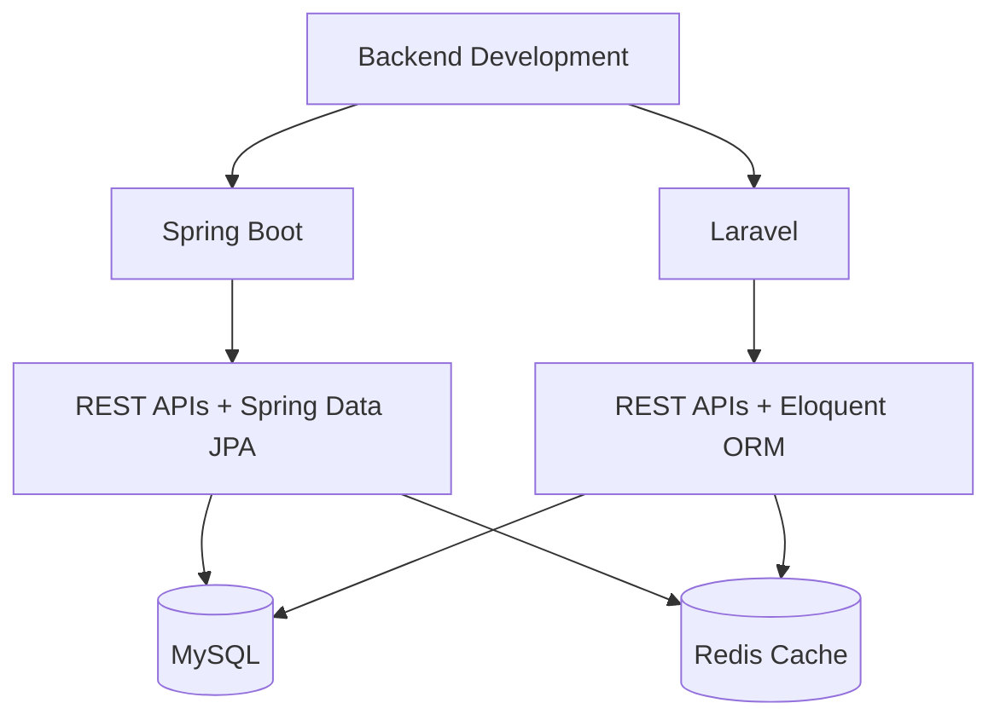
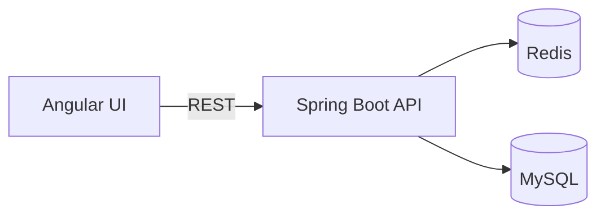

 

---

## 👨‍💻 About Me

I'm an **Associate Software Development Engineer** who enjoys building fast, clean and reliable backend systems.

- ☕ Backend development with **Spring Boot**
- 🐘 Backend development with **Laravel / PHP**
- 🔗 Designing and building **REST APIs**
- ⚡ Using **Redis** to cut database load and speed up responses
- 🗄️ Data modelling and queries with **MySQL**
- 🐧 Comfortable with **Linux** and **Git**
- 🌱 Currently levelling up in **Backend Engineering & System Design**

---

## 🛠️ Tech Stack

**Languages**

**Backend & Databases**

**Frontend**

**Tools**

---

## 🚀 Backend Skills

<table>
<tr>
<td width="33%" valign="top">

### 🔹 Spring Boot
- REST API development
- Spring Data JPA
- CRUD operations
- Request validation
- Exception handling
- Authentication & authorization

</td>
<td width="33%" valign="top">

### 🔹 Laravel
- REST API development
- MVC architecture
- Eloquent ORM
- Authentication
- Middleware
- Request validation

</td>
<td width="33%" valign="top">

### 🔹 Redis
- Application caching
- Session storage
- Fast key-value access
- Reducing database load

</td>
</tr>
</table>

---

## 📌 Featured Project

### 💳 Universal Billing System

> A full-stack billing application for creating bills, processing payments and giving customers permanent bill-view links.

| | |
|---|---|
| **Backend** | Spring Boot |
| **API** | REST |
| **Database** | MySQL |
| **Caching** | Redis |
| **Frontend** | Angular |

---

## 📊 GitHub Stats

---

## 📫 Connect With Me

  

💬 *Open to collaboration on backend projects and APIs.*

### 💻 Code • Build • Learn • Repeat 🚀

