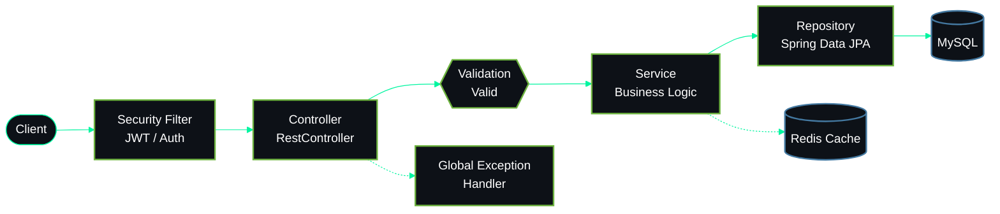
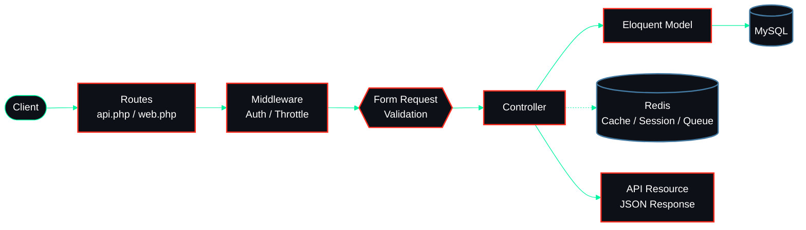
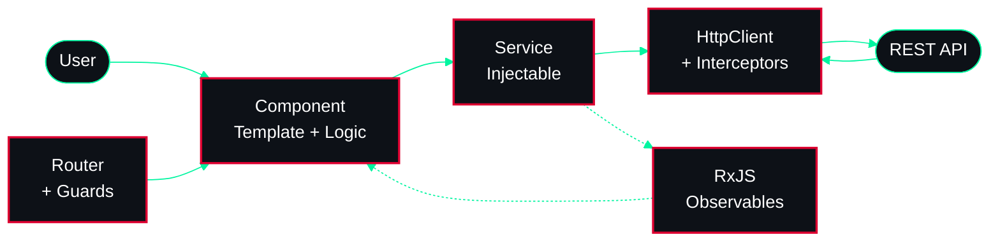
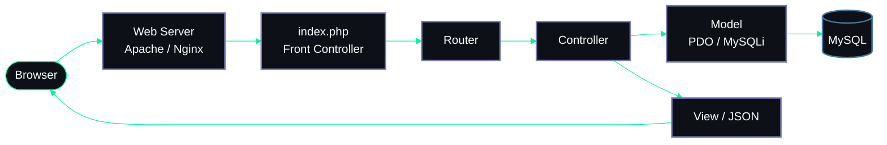
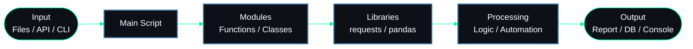

<div align="center">


<a href="https://github.com/sanishil">

</a>

<br/>


<br/>


</div>

<br/>


## `~/about`

```yaml
name:    Sani Shil
role:    Associate Software Development Engineer
main:    Java + Spring Boot
also:    Laravel / PHP
focus:   REST APIs · Caching · System Design
stack:   Redis · MySQL · Linux · Git
status:  Open to collaboration
mood:    Code • Build • Learn • Repeat
```

## `~/stack`

<div align="center">


</div>

## `~/skills`

<table width="100%">
<tr>
<th width="25%" align="left">☕ Spring Boot <i>(primary)</i></th>
<th width="25%" align="left">🐘 Laravel</th>
<th width="25%" align="left">⚡ Redis</th>
<th width="25%" align="left">🗄️ MySQL</th>
</tr>
<tr><td>REST APIs</td><td>REST APIs</td><td>Caching</td><td>Persistence</td></tr>
<tr><td>Spring Data JPA</td><td>MVC + Eloquent</td><td>Session storage</td><td>Spring integration</td></tr>
<tr><td>Validation &amp; exceptions</td><td>Middleware</td><td>Key-value access</td><td>Laravel integration</td></tr>
<tr><td>Auth &amp; authorization</td><td>Authentication</td><td>Reducing DB load</td><td>Query &amp; schema design</td></tr>
</table>

## `~/architecture`

<sub>How each stack in my toolbox flows, end to end.</sub>

### ☕ Spring Boot



### 🐘 Laravel



### 🅰️ Angular



### 🐘 PHP



### 🐍 Python



## `~/stats`

<div align="center">


</div>

## `~/now`

```diff
+ Building & improving REST APIs with Spring Boot and Laravel
+ Optimising performance with Redis caching
+ Deep-diving into Backend Engineering & System Design
# Open to collaborating on backend projects
```

## `~/connect`

<div align="center">

<a href="https://github.com/sanishil"></a>
<a href="https://linkedin.com/in/sanishil"></a>
<a href="https://sanishil.site.je"></a>


</div>
